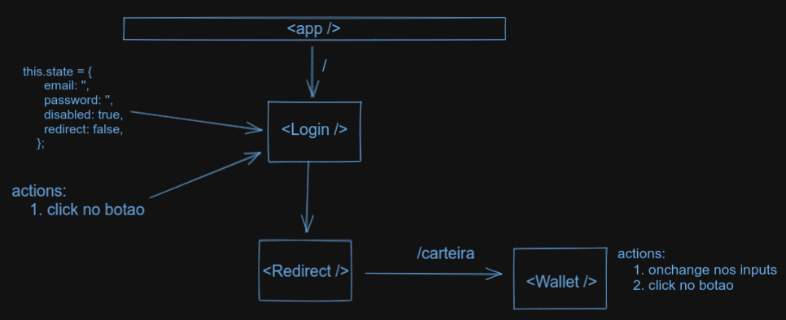

# Project Wallet

## Introdução
Esta aplicação é uma carteira de controle de gastos com conversor de moedas o usuário terá as ooções de:
  - Adicionar e remover um gasto;
  - Visualizar uma tabelas com seus gastos;
  - Visualizar o total de gastos convertidos para uma moeda de escolha;

## Habilidades
Neste projeto, foi utilizado Redux como gerenciador de estado e a biblioteca React Bootstrap para estilização.
## Desenvolvimento

### Tela Login


### Tela Wallet


### Fluxograma 
Fluxograma geral do projeto com seus componentes, rotas, states e actions.



Para iniciar o desenvolvimento, é necessário clonar o repositório do GitHub, acessar o projeto Wallet e intalar as dependências:
```shell
cd "diretorio de sua preferencia"

git clone git@github.com:gabrielmirandaBR/Wallet-CRUD.git

cd Wallet-CRUD

npm install
```
